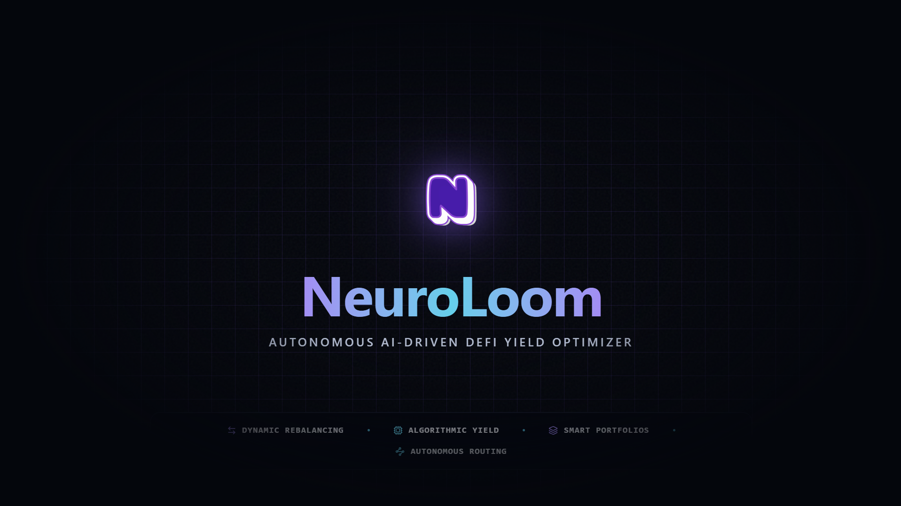
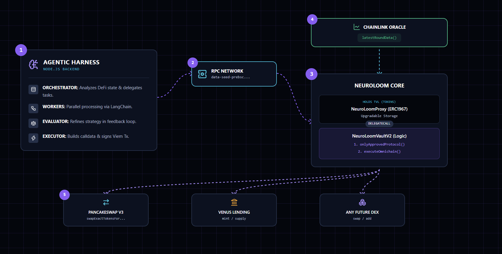

<div align="center">
  
</div>

# NEUROLOOM

> **Autonomous AI-Driven DeFi Yield Optimizer — Multi-Protocol Routing & Hardcoded MEV Resistance.**

NeuroLoom is a next-generation Decentralized Finance (DeFi) protocol that fuses advanced **Agentic Workflows** with mathematically guaranteed on-chain execution. It enables an autonomous AI engine to analyze, optimize, and route portfolios (Swap, Lending, Staking) 24/7 across the DeFi ecosystem, while strict Smart Contract guardrails protect the Total Value Locked (TVL) from MEV bots, flash loan attacks, and AI hallucinations.

Built for the **Indonesia Web3 Hackathon 2026**. **BNB Chain**.

<p align="center">
  
  
  
  
  
  
</p>

### At a glance

<div align="center">

<table>
  <tr>
    <th>Architecture</th>
    <th>Enforcement</th>
    <th>Stack</th>
  </tr>
  <tr>
    <td><b>Agentic Workflow:</b> Orchestrator-Workers & Evaluator-Optimizer LLM loops.</td>
    <td><b>AI Proposes, Chain Verifies:</b> Raw <code>calldata</code> is validated against live Chainlink USD feeds before execution.</td>
    <td><b>Full-Stack:</b> Next.js (DApp), Node.js (AI Engine), Hardhat (EVM), The Graph (Indexing).</td>
  </tr>
  <tr>
    <td><b>Multi-Protocol:</b> AI dynamically generates generic <code>calldata</code> for any allowed target protocol (PancakeSwap, Venus, etc).</td>
    <td><b>MEV Bounded:</b> Slippage is mathematically hardcapped. Over-slippage reverts the transaction entirely.</td>
    <td><b>Viem & SQLite:</b> Fast on-chain reads/writes and localized high-speed LLM memory states.</td>
  </tr>
</table>

</div>

---

## Table of contents

1. [The Problem](#the-problem)
2. [The Agentic Workflow Architecture](#the-agentic-workflow-architecture)
3. [Live Engine Output](#live-engine-output-the-orchestrator-in-action)
4. [The Vault Model (ERC-4626)](#the-vault-model-erc-4626)
5. [System Flow](#system-flow)
6. [Live Deployment (BSC Testnet)](#live-deployment-bsc-testnet)
7. [Repository Layout](#repository-layout)
8. [Technology Stack](#technology-stack)
9. [Getting Started](#getting-started)
10. [Security & Threat Model](#security--threat-model)
11. [Deterministic Test Coverage](#deterministic-test-coverage)
12. [On-Chain Provisioning & Operational Scripts](#on-chain-provisioning--operational-scripts)
13. [Known Limitations & Production Roadmap](#known-limitations--production-roadmap)

## 
---

## The Problem

Current Automated Yield Optimizers suffer from two fatal flaws:
1. **Rigid Automation & Protocol Silos:** Traditional vaults use static, hardcoded logic that locks liquidity into a single, specific pool. By the time a human manually rebalances a position, the alpha is gone.
2. **MEV Slaughter & AI Hallucination:** If a vault is directly controlled by an AI without circuit breakers, MEV bots will monitor the mempool for sandwich attacks. Furthermore, LLMs can hallucinate decimal places or target addresses, leading to drained TVLs.

NeuroLoom bridges this gap by combining dynamic, multi-perspective AI with a multi-layered on-chain Security Guard.

---

## The Agentic Workflow Architecture

NeuroLoom does not rely on a simple, static LLM prompt. It implements rigorous Agentic Workflows based on industry-leading research:

* **Orchestrator-Workers Workflow:** A central Orchestrator LLM analyzes real-time AMM liquidity depth and lending pool utilization rates, dynamically delegating route simulations to specialized worker LLMs (e.g., Yield Strategist, Liquidity Risk Manager). This parallel processing generates the optimal yield-routing strategy.
* **Evaluator-Optimizer Workflow:** Before execution, the generated strategy is evaluated and refined in a strict LLM feedback loop to ensure maximum APY and zero hallucination before finalizing the action.

---

## Live Engine Output: The Orchestrator in Action

The following is a real execution log from the NeuroLoom AI backend demonstrating the parallel delegation and synthesis process:

```console
[SYSTEM] NeuroLoom Autonomous Agent is now ONLINE. Press Ctrl+C to stop safely.
[2026-09-18T13:02:44.285Z] INITIALIZING NEUROLOOM AI CYCLE
=========================================================
⚠️ [SCENARIO TEST] Market Crash + ZERO Volume -> Triggers a HOLD (Safety)
[ORCHESTRATOR] Analyzing AMM liquidity and planning task delegation...
[ORCHESTRATOR] Delegating 1 specialized approaches to minimize API overhead.
[WORKERS] Generating specialized yield and risk analysis...
  -> [WORKER 1 | YIELD_STRATEGIST] Recommends: HOLD
[SYNTHESIZER] Evaluating worker reports and finalizing multi-protocol routing decision...

[EVALUATOR] Initiating Risk Management Audit Loop...
  -> [ITERATION 1] Audiiting proposed decision...
     Status: PASS
[FINAL DECISION] Action: HOLD | Allocation: 0%
[REASONING] The recent 15.5% price drop and warnings of liquidity vacuums indicate high volatility and slippage risks, making capital preservation in stablecoins the optimal until market stability is restored.
🛡️ [EXECUTOR] Action is HOLD. Preserving gas. No on-chain transaction broadcasted.
[SYSTEM] Cycle completed. Awaiting 57 seconds for the next iteration...

```

## The Vault Model (ERC-4626)

The core primitive of NeuroLoom is the `NeuroLoomVaultV2` contract, adopting the `ERC4626Upgradeable` standard behind an `ERC1967Proxy`:

1. **Liquidity Provision (ERC-4626):** Tokenized vault standard enables seamless deposit/withdraw integrations.
2. **Multi-Protocol Execution Calls:** The AI agent compiles raw instructions and calls `executeOmnichain(targetProtocol, data, tokenIn, tokenOut, amountIn, expectedAmountOutMin)`.
3. **The Protocol Allowlist (Layer 1 Guardrail):** The vault asserts that `targetProtocol` exists in a strict admin-approved whitelist, preventing the AI from routing funds to malicious or arbitrary smart contracts.
4. **The Oracle Gate & Decimal Agnostic Math (Layer 2 Guardrail):** The Vault dynamically maps the asset pair to its corresponding Chainlink feeds. It reads the exact token decimals via `IERC20Metadata`, dynamically normalizes the math to prevent decimal hallucinations, checks for stale data, and validates the expected slippage boundary.
5. **Generic Execution & Absolute Validation (Layer 3 Guardrail):** Protected by OpenZeppelin v5's `ReentrancyGuard`, the contract executes `targetProtocol.call(data)`. If the returned token balance (`balanceAfter - balanceBefore`) is strictly less than `expectedAmountOutMin`, the contract reverts the entire transaction. Maximum loss is hardcapped at 200 BPS (2%).

---

## System Flow

<div align="center">
  
</div>

---

## Live Deployment (BSC Testnet)

**Network:** chain `97` (BNB Smart Chain Testnet)

| Entity | Address (BscScan) |
| --- | --- |
| NeuroLoomProxy (Vault) | `0xe38887648d7272e9Eb3C06628767bb3d84a9FF4E` |
| Implementation V2 | `0x3c699d1a67cc83e6c91770741aeb6f5f79945c32` |
| Chainlink BNB/USD | `0x2514895c72f50D8bd4B4F9b1110F0D6bD2c97526` |
| The Graph Subgraph | `https://api.studio.thegraph.com/query/.../neuroloom-bsc-testnet` |

---

## Repository Layout

```text
NeuroLoom/
├── frontend/                      # Next.js DApp (Dashboard, Landing, AI Terminal)
│   ├── public/                    # Static UI assets and banners
│   └── src/
│       ├── app/                   # Next.js App Router pages and layouts
│       ├── components/            # Modular React components (Terminal, Vaults, etc.)
│       └── lib/                   # Utility functions and custom hooks
├── backend/                       # AI Agentic Harness (Node.js, LangChain, SQLite)
│   └── src/
│       ├── abi/                   # Compiled smart contract ABIs for Viem
│       ├── ai/
│       │   ├── agent.ts           # The Orchestrator-Workers delegation logic
│       │   └── evaluator.ts       # Evaluator-Optimizer feedback loop
│       ├── chain/
│       │   ├── executor.ts        # Calldata builder & AI transaction signer
│       │   └── vault.ts           # Vault state reader and on-chain interaction
│       └── data/                  # SQLite database for AI memory states
|       │
|       └── tests/                 # On-Chain Provisioning & Operational Scripts (due to rate limit API)
├── contracts/                     # Hardhat v3 workspace (ERC-4626 Vault, Proxy, Tests)
│   ├── contracts/                 # NeuroLoomVaultV2.sol, NeuroLoomProxy.sol, MockOracle.sol, MockERC20.sol, MockDex.sol
│   ├── scripts/                   # Deployment, smoke tests, whitelist protocol, and UUPS upgrades
│   └── test/                      # E2E Slippage & Security Guard MEV tests
└── neuroloom-bsc-testnet/         # The Graph Subgraph (Event Indexing)
    ├── abis/                      # NeuroLoomVaultV2.json ABI definitions
    ├── src/                       # AssemblyScript mappings for event handlers
    └── tests/                     # Subgraph unit tests

```

---

## Technology Stack

| Layer | Technologies Used |
| --- | --- |
| **Smart Contracts** | Solidity `0.8.28`, Hardhat v3 (Ignition & Viem), OpenZeppelin v5 UUPS |
| **Frontend (Core & UI)** | Next.js 16.3, React 19, TailwindCSS v4, DaisyUI, Framer Motion, tsParticles |
| **Frontend (Web3 & Data)** | Wagmi, Viem, RainbowKit, Apollo Client (GraphQL) |
| **Backend (AI Engine)** | Node.js (tsx), TypeScript, `viem`, `@dotenvx/dotenvx` |
| **AI / LLM Framework** | Node.js (tsx), `@langchain/core` |
| **Active LLM Model** | Groq API (qwen/qwen3.8-27b) *— dynamic Orchestrator routing* |
| **Data & Indexing** | SQLite (AI Memory state), The Graph (On-chain event streaming) |

---

## Production Deployment

The NeuroLoom frontend is built with Next.js and optimized for zero-config deployment on Vercel. Vercel automatically provisions the serverless environments required for the UI and API routes.

1. Import the repository into your Vercel dashboard.
2. Set the **Root Directory** to `frontend` (Vercel will auto-detect Next.js).
3. Leave the build command as the default (`npm run build`).
4. **No environment variables required.** All network configurations, including the BSC Testnet RPC URLs and Proxy Contract addresses, are hardcoded constants within the component files.

---

## Getting Started

**Prerequisites:** Node.js 18+ and npm/yarn.
*Note: NeuroLoom enforces Separation of Duties. You must use two distinct wallets for Admin & AI (or use the same wallet strictly for local Testnet demonstration).*

### 1. Installation
```bash
git clone <repo-url>
cd NeuroLoom

# Install dependencies across all workspaces
cd contracts && npm install
cd backend && npm install
cd frontend && npm install
```

### 2. Environment Variables

Create a `.env` file in both `/contracts` and `/backend` directories.

| **Variable** | **Location** | **Required** | **Purpose** |
| --- | --- | --- | --- |
| `PRIVATE_KEY` | `/contracts/.env` | Yes | Admin Deployer Wallet for proxy upgrades & whitelisting. |
| `AI_PRIVATE_KEY` | `/backend/.env` | Yes | AI Executor Wallet for signing live omnichain trades. |
| `GROQ_API_KEY` | `/backend/.env` | Yes | LLM Engine inference capability. |
| `MOCK_SCENARIO` | `/backend/.env` | No | Set to `"DEMO"` for micro-transactions (0.0001 USDT) during live pitches. |

### 3. Quick Start Commands

Run these core services from their respective directories:

| **Service** | **Command** | **Description** |
| --- | --- | --- |
| **Smart Contracts** | `npx hardhat test test/E2ESlippage.test.ts` | Runs deterministic security & MEV attack simulations. |
| **AI Engine** | `npx tsx src/index.ts` | Boots the Autonomous Harness (requires Groq key). |
| **Frontend** | `npm run dev` | Launches the Next.js Dashboard at `http://localhost:3000`. |

## Security & Threat Model

| **Threat** | **Applied Mitigation** | **Status** |
| --- | --- | --- |
| Unauthorized Execution | Strict `AccessControl` (`onlyRole(AI_EXECUTOR_ROLE)`) | ✅ On-chain |
| AI Arbitrary Execution | Strict On-Chain Protocol Allowlist (`approvedProtocols`) | ✅ On-chain |
| AI Route/Decimal Hallucination | Pre-execution Oracle validation & dynamic `IERC20Metadata` | ✅ On-chain |
| Reentrancy Attacks | OpenZeppelin v5 `ReentrancyGuard` (ERC-7201 safe) | ✅ On-chain |
| Oracle Stale / Flash crash | Rejects Chainlink data older than 3600 seconds | ✅ On-chain |
| Sandwich MEV Attack | Absolute post-execution balance check via Fair Value | ✅ On-chain |
| AI API Failure / Network Outage | Evaluator Circuit Breaker (Halts execution to `HOLD`) | ✅ Off-chain |

## Deterministic Test Coverage

NeuroLoom's core security mechanisms and upgradeable proxy architecture are strictly validated using Hardhat v3, testing both aggressive MEV simulated attacks and multi-protocol happy paths with dynamic decimal mapping.

```
$ npx hardhat test

  Deployment & Proxy Upgradeability (smoke-test.ts)
    ✔ Must deploy ERC1967 Proxy and Vault V2 Implementation (85ms)
    ✔ Must initialize default admin and grant AI_EXECUTOR_ROLE (62ms)
    ✔ Must allow Admin to successfully pause and unpause the vault (45ms)

  E2E BSC Testnet Fork: Anti-Sandwich Attack & Multi-Protocol Routing (E2ESlippage.test.ts)
     🛡️ Security Guards (Negative Paths)
      ✔ Must revert if called by a non-AI role (Access Control) (295ms)
      ✔ Must revert if AI targets an unapproved protocol (Protocol Whitelist) (120ms)
      ✔ Must revert if AI sends an expectedAmountOutMin below the 2% slippage limit (Anti-MEV) (158ms)
     ⚡ True Multi-Protocol Routing (Happy Path)
      ✔ Must successfully execute a cross-protocol swap with correct calldata & dynamic decimals (350ms)

  7 passing (3s)
```

## On-Chain Provisioning & Operational Scripts

Targeted network scripts for real-world deployment, security provisioning, and live BSC Testnet demonstrations. These enforce role-based access control and integrate the Vault with decentralized infrastructure.

**Run these commands from their designated workspace directories:**

| **Phase** | **Command** | **Directory** | **Purpose** |
| --- | --- | --- | --- |
| **1. Upgrade Logic** | `npx hardhat run scripts/upgradeToV2.ts --network bscTestnet` | `/contracts` | Seamless UUPS implementation swap to `NeuroLoomVaultV2`. |
| **2. Whitelist Target** | `npx hardhat run scripts/whitelist-protocol.ts --network bscTestnet` | `/contracts` | Admin authorization for the V3 Router at the contract level. |
| **3. Oracle Setup** | `npx tsx src/tests/setup-oracle.ts` | `/backend` | Connects Chainlink BNB/USD to the dynamic oracle system. |
| **4. Demo Rebalance** | `npx tsx src/tests/rebalance-executed.ts` | `/backend` | Bypasses LLM delay to blast a deterministic entry payload (`BUY_WBNB`). |
| **5. Demo Unwind** | `npx tsx src/tests/unwind-position.ts` | `/backend` | Simulates an AI exiting a volatile AMM position (`SELL_WBNB`). |
| **6. Audit Vault** | `npx tsx src/tests/debug-vault.ts` | `/backend` | Read-only diagnostic utility fetching real-time idle and active TVL. |
---

## Known Limitations & Production Roadmap

NeuroLoom was built as a **zero-cost prototype** for the Indonesia Web3 Hackathon. The current architecture prioritizes secure forward-execution, on-chain safety guards, and lean deployment over global scalability.

To transition this architecture into a production-ready Mainnet environment, the following infrastructure upgrades are scoped:

1. **True AMM Concentrated Liquidity & Advanced Unwinding (ERC-4626 Completeness):**
   * **Current Prototype (Lending & Tactical Repositioning):** The current architecture perfectly handles linear ERC-20 execution paths. The AI can successfully deploy funds into Venus Lending (e.g., USDT ↔ vUSDT) to generate passive yield, or execute tactical asset swaps (e.g., USDT ↔ WBNB) via PancakeSwap's `exactInputSingle`. Because these are linear token paths, **position unwinding and user `withdraw()` are fully functional** by simply reversing the routing logic.
   * **Production Target (Concentrated Liquidity Provision):** While lending and swaps are solved, **True AMM Liquidity Provision** on PancakeSwap V3 remains pending. True LPing does not return an ERC-20 token; it mints an ERC-721 NFT via `NonfungiblePositionManager` containing specific price tick ranges. The roadmap target is to build a dedicated NFT position-tracking module, allowing the AI to actively manage concentrated liquidity ranges to harvest actual DEX trading fees.
2. **Impermanent Loss (IL) Modeling:**
    - *Current Prototype:* Worker agents evaluate APY and qualitative risk signals but do not compute Impermanent Loss exposure mathematically.
    - *Production Target:* Add a dedicated IL calculation module (price divergence vs. pool composition) so LP allocation decisions strictly account for IL mitigation, not just headline APY.
3. **AI Executor Key Management:**
    - *Current Prototype:* `AI_PRIVATE_KEY` is loaded from a local `.env` file for rapid hackathon iteration.
    - *Production Target:* Migrate to KMS-backed signing (AWS KMS / HashiCorp Vault) so the raw private key never exists in plaintext or process memory.
4. **AI Memory & Database Scaling:**
    - *Current Prototype:* Uses local `SQLite` for isolated, high-speed AI memory logging.
    - *Production Target:* Migration to a distributed **PostgreSQL** architecture coupled with **Redis** caching to safely handle concurrent state-sharing across hundreds of AI workers.
5. **Closed-Loop Execution Memory:**
    - *Current Prototype:* The AI agents log their intended decisions (action, amount, reasoning) to the local database prior to on-chain execution, but the final on-chain settlement status (success/revert) is not written back.
    - *Production Target:* Upgrade the database schema to capture `txHash`, `status`, and `errorReason`. This creates a closed feedback loop, allowing the AI to retrieve past failed transactions and dynamically learn from on-chain rejections (e.g., adjusting slippage tolerance after a revert).
6. **Oracle Feed Diversity:**
    - *Current Prototype:* The slippage guardrail intercepts data from a single Chainlink aggregator per pair.
    - *Production Target:* Integration of multi-asset Time-Weighted Average Price (TWAP) and redundant decentralized oracle networks (DONs) to neutralize isolated flash-crash vulnerabilities.
7. **AI Evaluation Framework & Harness Engineering:**
    - *Architectural Clarity:* NeuroLoom's AI system is an Orchestrator-Workers Workflow with an Evaluator-Optimizer cycle — not a traditional autonomous agent. Orchestration flow is controlled by deterministic code; LLMs are called through predefined paths, not self-directed tool loops. This limits blast radius and keeps the smart contract as the ultimate source of truth.
    - *Current Prototype:* Relies on prompt-engineered JSON formatting via Groq without formal evaluation. AI decisions are logged but not evaluated against financial ground truth. Worker outputs are accepted if they pass JSON parsing; there is no automated check that the reasoning is financially sound.
    - *Production Target — Evaluation Stack:*
        - **Single-turn evals:** Given a market data snapshot, assert that each Worker produces a directionally correct decision against a curated ground-truth dataset. Runnable deterministically on every prompt/model change.
        - **End-state evals:** After each on-chain execution, compare vault's actual token balances against the expected post-trade state. On-chain truth is the ground truth.
        - **Regression suite:** A frozen snapshot of `(market_input, expected_action)` pairs that must pass before any prompt or model version is promoted.
        - **LLM-as-judge (optional):** Evaluate Evaluator-Optimizer reasoning quality for open-ended financial justifications.
    - *Production Target — Observability & Harness Stack:*
        - **Framework Migration:** Migrate to the native **Claude Agent SDK**. Utilize the `withStructuredOutput()` paradigm (via Zod schemas) to guarantee type-safe AI responses and eliminate JSON hallucination.
        - **Tool Calling:** Equip agents with explicit deterministic tool-calling (e.g., calling a strict `calculate_impermanent_loss()` function) rather than relying on LLM text reasoning for math.
        - **State & Tracing:** Integrate **LangGraph** as a state manager for the Evaluator-Optimizer cycle (replacing the imperative MAX_ITERATIONS loop), and use **LangSmith** for per-node tracing, latency, and cost monitoring.
        - **Cost & Drift Control:** Enforce per-cycle cost budgets (aborting if LLM cost > projected yield) and run the regression suite on a weekly schedule to detect upstream model drift.

---

*NeuroLoom — AI that routes, Blockchain that verifies.* 
Building for Indonesia Web3 Hackathon. BNB Chain.
