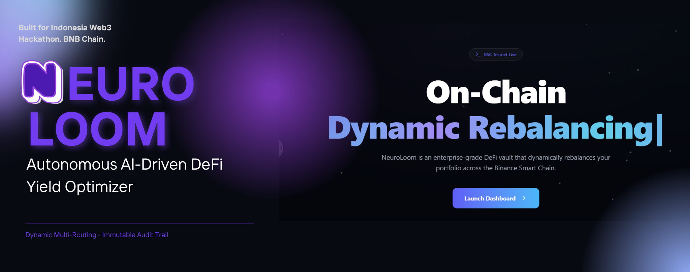

<div align="center">
  
</div>

# NEUROLOOM

> **Autonomous AI-Driven DeFi Yield Optimizer — True Omnichain Routing & Hardcoded MEV resistance.**

NeuroLoom is a next-generation Decentralized Finance (DeFi) protocol that fuses advanced **Agentic Workflows** with mathematically guaranteed on-chain execution. It enables an autonomous AI engine to analyze, optimize, and route portfolios (Swap, Lending, Staking) 24/7 across the DeFi ecosystem, while strict Smart Contract guardrails protect the Total Value Locked (TVL) from MEV bots, flash loan attacks, and AI hallucinations.

Built for the **Indonesia Web3 Hackathon 2026** on the **BNB Chain**.

<p align="center">
  
  
  
  
  
  
</p>

### At a glance

<div align="center">

<table>
  <tr>
    <th>Architecture</th>
    <th>Enforcement</th>
    <th>Stack</th>
  </tr>
  <tr>
    <td><b>Agentic Workflow:</b> Orchestrator-Workers & Evaluator-Optimizer LLM loops.</td>
    <td><b>AI Proposes, Chain Verifies:</b> Raw <code>calldata</code> is validated against live Chainlink USD feeds before execution.</td>
    <td><b>Full-Stack:</b> Next.js (DApp), Node.js (AI Engine), Hardhat (EVM), The Graph (Indexing).</td>
  </tr>
  <tr>
    <td><b>Omnichain:</b> AI dynamically generates generic <code>calldata</code> for any target protocol (PancakeSwap, Venus, etc).</td>
    <td><b>MEV Bounded:</b> Slippage is mathematically hardcapped. Over-slippage reverts the transaction entirely.</td>
    <td><b>Viem & SQLite:</b> Fast on-chain reads/writes and localized high-speed LLM memory states.</td>
  </tr>
</table>

</div>

---

## Table of contents

1. [The Problem](#the-problem)
2. [The Agentic Workflow Architecture](#the-agentic-workflow-architecture)
3. [Live Engine Output](#live-engine-output-the-orchestrator-in-action)
4. [The Vault Model (ERC-4626)](#the-vault-model-erc-4626)
5. [System Flow](#system-flow)
6. [Live Deployment (BSC Testnet)](#live-deployment-bsc-testnet)
7. [Repository Layout](#repository-layout)
8. [Technology Stack](#technology-stack)
9. [Getting Started](#getting-started)
10. [Security & Threat Model](#security--threat-model)

---

## The Problem

Current Automated Yield Optimizers suffer from two fatal flaws:
1. **Rigid Automation & Protocol Silos:** Traditional vaults use static, hardcoded logic that locks liquidity into a single, specific pool. By the time a human manually rebalances a position, the alpha is gone.
2. **MEV Slaughter & AI Hallucination:** If a vault is directly controlled by an AI without circuit breakers, MEV bots will monitor the mempool for sandwich attacks. Furthermore, LLMs can hallucinate decimal places, leading to drained TVLs.

NeuroLoom bridges this gap by combining dynamic, multi-perspective AI with a dual-layered on-chain Slippage Guard.

---

## The Agentic Workflow Architecture

NeuroLoom does not rely on a simple, static LLM prompt. It implements rigorous Agentic Workflows based on industry-leading research:

* **Orchestrator-Workers Workflow:** A central Orchestrator LLM analyzes real-time order book dynamics and dynamically delegates route simulations to specialized worker LLMs (e.g., Risk Manager, Momentum Analyst). This parallel processing generates the absolute best multi-hop path.
* **Evaluator-Optimizer Workflow:** Before execution, the generated strategy is evaluated and refined in a strict LLM feedback loop to ensure maximum APY and zero hallucination before finalizing the action.

---

## Live Engine Output: The Orchestrator in Action

The following is a real execution log from the NeuroLoom AI backend demonstrating the parallel delegation and synthesis process:

```console
[2026-09-16T10:20:13.006Z] INITIALIZING NEUROLOOM AI CYCLE
=========================================================
[MARKET DATA] WBNB: $710.8 (24H: -1.0849108846805722%)
[VAULT STATE] Balance: 0 WBNB | 0 USDT
[AGENT] Analyzing market conditions and memory state...
[ORCHESTRATOR] Analyzing state and planning task delegation...
[ORCHESTRATOR] Delegating 2 specialized approaches.
[WORKERS] Generating specialized analysis concurrently...
  -> [WORKER 1 | TECHNICAL_ANALYST] Recommends: HOLD
  -> [WORKER 2 | RISK_MANAGER] Recommends: HOLD
[SYNTHESIZER] Evaluating worker reports and finalizing decision...
[DECISION] Action: HOLD | Allocation: 0%
[REASONING] Both WBNB and USDT vault balances are zero, making trade execution impossible regardless of price movement.
[EXECUTION] Action is HOLD. Preserving gas. No transaction broadcasted.
[SYSTEM] Cycle completed. Awaiting 60 seconds for the next iteration...
```
## The Vault Model (ERC-4626)

The core primitive of NeuroLoom is the `NeuroLoomVaultV2` contract, adopting the `ERC4626Upgradeable` standard behind an `ERC1967Proxy`:

1. **Liquidity Provision (ERC-4626):** Tokenized vault standard enables seamless deposit/withdraw integrations.
2. **Omnichain Execution Calls:** The AI agent compiles raw instructions and calls `executeOmnichain(targetProtocol, data, tokenIn, tokenOut, amountIn, expectedAmountOutMin)`.
3. **The Oracle Gate (Layer 1 Guardrail):** The Vault intercepts the call, fetches `latestRoundData()` from Chainlink, checks for stale data, and validates the expected slippage boundary.
4. **Generic Execution & Absolute Validation (Layer 2 Guardrail):** The contract executes `targetProtocol.call(data)`. If the returned token balance (`balanceAfter - balanceBefore`) is strictly less than `expectedAmountOutMin`, the contract reverts the entire transaction. Maximum loss is hardcapped at 200 BPS (2%).

---

## System Flow

```text
                ┌─────────────────────────────────────────────────────────────┐
                │             AGENTIC HARNESS (Node.js Backend)               │
                │ 1. ORCHESTRATOR: Analyzes market & delegates tasks          │
                │ 2. WORKERS: Parallel processing via LangChain (Gemma 4 MoE) │
                │ 3. EVALUATOR: Refines strategy in a strict feedback loop    │
                │ 4. EXECUTOR: Builds 'calldata' & signs Viem Transaction     │
                └──────────────────────┬──────────────────────────────────────┘
                                       │ RPC (BSC Testnet)
                        ┌──────────────▼─────────────┐
                        │  NeuroLoomProxy (ERC1967)  │ <── Holds TVL (Tokens)
                        │  deployed 0xe388…FF4E      │ <── Upgradable Storage
                        └──────────────┬─────────────┘
                                       │ delegates calls to
                        ┌──────────────▼─────────────┐   ┌──────────────────────┐
                        │  NeuroLoomVaultV2 (Logic)  │───▶   Chainlink Oracle   │
                        │  _validateSlippage()       │   │  latestRoundData()   │
                        │  executeOmnichain()        │   └──────────────────────┘
                        └──────────────┬─────────────┘
                                       │ If safe, injects raw calldata
           ┌───────────────────────────┼───────────────────────────┐
           ▼                           ▼                           ▼
 ┌───────────────────┐       ┌───────────────────┐       ┌───────────────────┐
 │   PancakeSwap V3  │       │   Venus Lending   │       │   Any Future DEX  │
 │ exactInputSingle  │       │    mint/supply    │       │     swap/add      │
 └───────────────────┘       └───────────────────┘       └───────────────────┘
```

---

## Live Deployment (BSC Testnet)

**Network:** chain `97` (BNB Smart Chain Testnet)

| Entity | Address (BscScan) |
| --- | --- |
| NeuroLoomProxy (Vault) | `0xe38887648d7272e9Eb3C06628767bb3d84a9FF4E` |
| Implementation V2 | `0x07e63e62adefd7dc10f5e46e99f28cbbb1b61474` |
| Chainlink BNB/USD | `0x2514895c72f50D8bd4B4F9b1110F0D6bD2c97526` |
| The Graph Subgraph | `https://api.studio.thegraph.com/query/.../neuroloom-bsc-testnet` |

---

## Repository Layout

```text
NeuroLoom/
├── frontend/                      # Next.js DApp (Dashboard, Landing, AI Terminal)
│   ├── public/                    # Static UI assets and banners
│   └── src/
│       ├── app/                   # Next.js App Router pages and layouts
│       ├── components/            # Modular React components (Terminal, Vaults, etc.)
│       └── lib/                   # Utility functions and custom hooks
├── backend/                       # AI Agentic Harness (Node.js, LangChain, SQLite)
│   └── src/
│       ├── abi/                   # Compiled smart contract ABIs for Viem
│       ├── ai/
│       │   ├── agent.ts           # The Orchestrator-Workers delegation logic
│       │   └── evaluator.ts       # Evaluator-Optimizer feedback loop
│       ├── chain/
│       │   ├── executor.ts        # Omnichain calldata builder & transaction signer
│       │   └── vault.ts           # Vault state reader and on-chain interaction
│       └── data/                  # SQLite database for AI memory states
├── contracts/                     # Hardhat v3 workspace (ERC-4626 Vault, Proxy, Tests)
│   ├── contracts/                 # NeuroLoomVaultV2.sol, NeuroLoomProxy.sol, MockOracle.sol
│   ├── scripts/                   # Deployment and UUPS upgrade scripts
│   └── test/                      # E2E Slippage & Security Guard MEV tests
└── neuroloom-bsc-testnet/         # The Graph Subgraph (Event Indexing)
    ├── abis/                      # NeuroLoomVaultV2.json ABI definitions
    ├── src/                       # AssemblyScript mappings for event handlers
    └── tests/                     # Subgraph unit tests
```
---

## Technology Stack

| Layer | Technologies Used |
| --- | --- |
| **Smart Contracts** | Solidity `0.8.28`, Hardhat v3 (Ignition & Viem), OpenZeppelin UUPS |
| **Frontend (Core & UI)** | Next.js 16.3, React 19, TailwindCSS v4, DaisyUI, Framer Motion, tsParticles |
| **Frontend (Web3 & Data)** | Wagmi, Viem, RainbowKit, Apollo Client (GraphQL), X402 Protocol |
| **Backend (AI Engine)** | Node.js (tsx), TypeScript, `viem`, `@dotenvx/dotenvx` |
| **AI / LLM Framework** | Node.js (tsx), `@langchain/core` |
|**Active LLM Model** | OpenRouter (Gemma 4 MoE) *— dynamic Orchestrator routing* |
| **Data & Indexing** | SQLite (AI Memory state), The Graph (On-chain event streaming) |

---

## Getting Started

**Prerequisites:** Node.js 18+ and npm/yarn.

### 1. Smart Contracts

```bash
cd contracts
npm install
npx hardhat test test/E2ESlippage.test.ts test/SecurityGuard.test.ts # Run security tests
```

### 2. AI Backend Engine

```bash
cd backend
npm install
```

Create a `.env` file in `/backend`:

```
OPENROUTER_API_KEY=your_openrouter_api_key
AI_PRIVATE_KEY=your_ai_executor_wallet_private_key
```

Run the Autonomous Harness:

```bash
npx tsx src/index.ts
```

### 3. Frontend Dashboard

```bash
cd frontend
npm install
npm run dev
```

---

## Security & Threat Model

| Threat | Applied Mitigation | Status |
|---|---|---|
| AI Route/Amount Hallucination | Pre-execution Oracle floor validation | ✅ On-chain |
| Oracle Stale / Flash crash | Rejects Chainlink data older than 3600 seconds | ✅ On-chain |
| Sandwich MEV Attack | Absolute post-execution balance check | ✅ On-chain |
| AI Infinite Loop | Memory-aware prompting via localized SQLite DB | ✅ Off-chain |

---

## Known Limitations & Production Roadmap

NeuroLoom was built as a **zero-cost prototype** for the Indonesia Web3 Hackathon. The current architecture prioritizes proof-of-concept execution, modularity, and lean deployment over global scalability. 

To transition this architecture into a production-ready Mainnet environment, the following infrastructure upgrades are mapped out:

1. **AI Framework Transition:**
   * *Current Prototype:* Relies on `@langchain/core` and OpenRouter (Gemma 4 MoE) for zero-cost rapid iteration.
   * *Production Target:* Migration to the native **Claude Agent SDK**. Anthropic's tooling is fundamentally designed to handle the exact Orchestrator-Workers and Evaluator-Optimizer loops we mapped out, offering vastly superior mathematical reasoning and near-zero hallucination rates for financial execution.
2. **AI Memory & Database Scaling:**
   * *Current Prototype:* Uses local `SQLite` for isolated, high-speed AI memory logging without network I/O overhead.
   * *Production Target:* Migration to a distributed **PostgreSQL** architecture coupled with **Redis** caching. This is necessary to safely handle concurrent state-sharing across hundreds of AI workers operating simultaneously on Mainnet.
3. **Oracle Feed Diversity:**
   * *Current Prototype:* The slippage guardrail intercepts data from a single Chainlink testnet aggregator.
   * *Production Target:* Integration of multi-asset Time-Weighted Average Price (TWAP) and redundant decentralized oracle networks (DONs) to completely neutralize isolated flash-crash vulnerabilities.

### Deterministic E2E Testing

NeuroLoom's core security mechanisms are strictly validated using Hardhat v3 to simulate live MEV attack scenarios.

```console
$ npx hardhat test test/E2ESlippage.test.ts test/SecurityGuard.test.ts

  E2E Mainnet Fork: Anti-Sandwich Attack & Omnichain (Hardhat v3)
    ✔ Must revert if the AI sends an expectedAmountOutMin below the reasonable limit (MEV Attack Simulation). (8960ms)

  Security Audit: NeuroLoomVaultV2 (Hardhat v-next)
    ✔ Must successfully deploy the V2 contract on the local network.
    ✔ The AI_EXECUTOR_ROLE must be recognized deterministically.

  3 passing (3 nodejs)
```

*NeuroLoom — AI that routes, Blockchain that verifies.*

