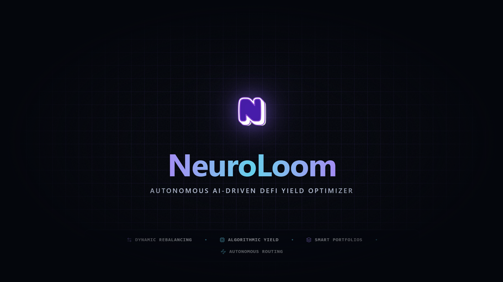
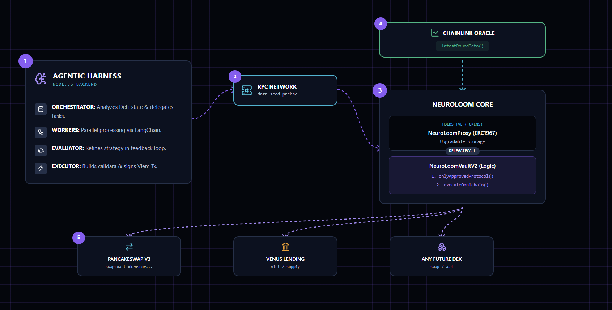

<div align="center">
  
</div>

# NEUROLOOM
  [](https://opensource.org/licenses/MIT)

> **Autonomous AI-Driven DeFi Yield Optimizer**

NeuroLoom is a fully autonomous DeFi protocol that fuses multi-agent AI workflows with deterministic on-chain execution. It empowers an AI engine to analyze market conditions and dynamically route capital across the BNB Chain ecosystem 24/7—utilizing tactical asset swaps, secure lending, active concentrated liquidity provision (PancakeSwap V3 NFTs), and strategic exposure to tokenized Real-World Assets (RWAs). To guarantee absolute security, strict smart contract guardrails—including a hard-capped 20% velocity allocation limit, real-time Chainlink oracle validation, and ERC-4626 inflation overrides, protect the Total Value Locked from MEV bots, vault exploits, and AI hallucinations.

Built for the **Indonesia Web3 Hackathon 2026**. **BNB Chain**.
Link: https://indonesiaweb3hack.xyz/en/projects/proj_231bfb01edfeb05edc

<p align="center">
  
  
  
  
  
  

</p>

### At a glance

<div align="center">

<table>
  <tr>
    <th>Architecture</th>
    <th>Enforcement</th>
    <th>Stack</th>
  </tr>
  <tr>
    <td><b>Agentic Workflow:</b> Orchestrator-Workers & Evaluator-Optimizer LLM loops with intra-cycle self-correction.</td>
    <td><b>AI Proposes, Chain Verifies:</b> Executions are strictly bounded by a 20% TVL Velocity Guard and live Chainlink USD feeds.</td>
    <td><b>Full-Stack:</b> Next.js (DApp), Node.js (AI Engine), Hardhat (EVM), The Graph (Indexing).</td>
  </tr>
  <tr>
    <td><b>Multi-Protocol & NFT LP:</b> AI dynamically routes generic <code>calldata</code> and autonomously manages PancakeSwap V3 Concentrated Liquidity NFTs.</td>
    <td><b>MEV & Exploit Bounded:</b> Slippage is mathematically hardcapped (2%), and custom ERC-4626 overrides neutralize share-price inflation attacks.</td>
    <td><b>Viem & SQLite:</b> Fast on-chain reads/writes and localized high-speed LLM memory states.</td>
  </tr>
</table>

</div>

---

## Table of contents

1. [The Problem](#the-problem)
2. [The Idea](#the-solution)
3. [The Agentic Workflow Architecture](#the-agentic-workflow-architecture)
4. [Live Engine Output](#live-engine-output-the-orchestrator-in-action)
5. [The Vault Architecture (Factory & ERC-4626)](#the-vault-architecture-factory--erc-4626)
6. [System Flow](#system-flow)
7. [Live Deployment (BSC Testnet)](#live-deployment-bsc-testnet)
8. [Repository Layout](#repository-layout)
9. [Technology Stack](#technology-stack)
10. [Cloud Architecture & Autonomous Execution](#cloud-architecture--autonomous-execution)
11. [Getting Started](#getting-started)
12. [Security & Threat Mitigation](#security--threat-mitigation)
13. [Known Limitations & Production Roadmap](#known-limitations--production-roadmap)
14. [License](#license)

## 
---

## The Problem

Delegating asset management within the Web3 ecosystem promises financial freedom, yet its mass adoption is hindered by three structural barriers. Aligned with the vision to make DeFi more efficient, intelligent, and accessible, the current ecosystem faces the following trilemma:

1. **The Complexity Bottleneck:** The current DeFi ecosystem demands its users to be financial experts. Setting up smart wallets, calculating gas fee fluctuations, and managing Concentrated Liquidity price ranges create massive UX friction. Retail users need an interface that abstracts all these technical complexities into a single-deposit experience without constant manual intervention.
2. **Liquidity Fragmentation & Capital Inefficiency:** Early-generation AI delegation models typically operate on isolated individual wallet architectures. This approach locks capital at a small scale, triggers high gas fee inefficiencies for every rebalancing action, and fundamentally prevents retail users from achieving economies of scale ("whale power") to enter advanced liquidity pools. Even when funds are pooled in standard vaults, the infrastructure remains vulnerable. In May 2026, the Inertia protocol lost $152,000 to a share price inflation attack (ERC-4626 donation attack).
3. **The Vulnerability of Blind Automation:** Handing complete capital control to fast AI without deterministic defensive walls is a fatal security flaw. In June 2026, one of Ethereum's top MEV Bots was drained of $7.5 million after its automated logic was tricked into approving malicious routing contracts. On the other hand, traditional vaults are too passive to react to market dynamics. The ecosystem requires an infrastructure that is not only autonomous but also mathematically secured at the smart contract level.

---
## The Solution

NeuroLoom emerges as an intelligent agent connecting artificial intelligence with decentralized execution on the BNB Chain. We bridge this gap by pairing a dynamic "Agentic Harness" with an impenetrable on-chain security layer.

Through the **ERC-4626 Omni-Vault** architecture, NeuroLoom pools retail user liquidity to eliminate individual gas costs and enable aggregate, institutional-scale Concentrated Liquidity management. Instead of rigid scripts, NeuroLoom’s backend AI continuously analyzes on-chain states and delegates yield-hunting to parallel LangChain workers. Every AI proposal must pass a strict "Evaluator Loop" (Chief Risk Officer Agent) before formulating raw `calldata`. However, the ultimate security lies in the `NeuroLoomVault` Smart Contract, which acts as a deterministic gatekeeper against AI hallucinations and market manipulation:

* - Unlike exploited automated bots, the NeuroLoom AI cannot be tricked into approving malicious contracts. The Vault enforces a strict `approvedProtocols` whitelist, ensuring capital only flows to vetted platforms (such as Thena Fusion and PancakeSwap V3).
* - To prevent passive oracle failures, every AI execution is validated against live Chainlink feeds. If a transaction exceeds a strict 2% slippage boundary (`MAX_SLIPPAGE_BPS`) or the data is older than 1 hour, the Vault forcefully reverts the transaction.
* - Leveraging OpenZeppelin v5's virtual offset defense and a custom `totalAssets()` override, the Vault dynamically tracks idle cash, lending positions, and LP principal, rendering share price manipulation and donation attacks (as seen in the Inertia case) mathematically impossible.
* - The smart contract mathematically hard-caps any single AI execution to a maximum of 20% of the live TVL (`MAX_VELOCITY_BPS`), completely mitigating severe drain risks.

NeuroLoom makes decisions and routes assets autonomously, making decentralized finance efficient and safe for everyone.

## The Agentic Workflow Architecture

NeuroLoom does not rely on a simple, static LLM prompt. It implements rigorous Agentic Workflows based on industry-leading research:

* **Orchestrator-Workers Workflow:** A central Orchestrator LLM analyzes real-time AMM liquidity depth and lending pool utilization rates, dynamically delegating route simulations to specialized worker LLMs (e.g., Yield Strategist, Liquidity Risk Manager). This parallel processing generates the optimal yield-routing strategy.
* **Evaluator-Optimizer Workflow:** Before execution, the generated strategy is evaluated and refined in a strict LLM feedback loop to ensure maximum APY and zero hallucination before finalizing the action.

---

## Live Engine Output: The Orchestrator in Action

The following is a real execution log from the NeuroLoom AI backend demonstrating the parallel delegation and synthesis process:

```console
[SYSTEM] NeuroLoom Autonomous Multi-Agent is ONLINE.
--- CLEARING LOGS ---

[SYSTEM] Initiating AUTONOMOUS AI Cycle - 2026-09-29T05:21:00.767Z
[DATA] Fetching live market conditions...
[DATA] Menyedot data teknikal BNB/USDT dari TAAPI.io v2...
[ORACLE] Live BNB/USD Price Verified: $756.74
[STATE] Live Vault USDT Balance: 6590.828979 USDT
[ORCHESTRATOR] Planning strategy & deploying workers...
[ORCHESTRATOR] Analyzing market and planning tasks.

[ORCHESTRATOR ANALYSIS]:
The BNB/USDT pair is in a ranging/sideways market with a neutral RSI (~42.6) and a negative MACD,
indicating no strong trend. In such a market, yield opportunities can be attractive because price volatility
is low, reducing impermanent loss risk. However, thelack of a clear trend also means liquidity pools
may experience higher slippage if traders are uncertain.
Therefore, both a YIELD_STRATEGIST to identify the most profitable and low‑risk yield farms,
and a LIQUIDITY_RISK worker to assess slippage, depth, and potential impermanent loss,
should be deployed to formulate a balanced strategy.

[AGENT] Synthesizing worker reports into action plan...
[EVALUATOR] Auditing AI Agent draft...
[EVALUATOR VERDICT] PASS
Reasoning: Deposit into the Yield Farm vault (0xD00b514048AFC47bFc4DE6a1646D5c63Bd23401a) is a neutral,
income‑generating action that aligns with the current ranging/sideways market structure.
The tool call correctly targets the available vault address and will allocate 1% of the vault balance,
which is a conservative and safe strategy given the market conditions.
[EXECUTOR] AI Selected Tool: execute_venus_deposit
[RISK CONTROL] Execution forced to 1% of vault balance: 65.908289 USDT
[EXECUTION] Signing transaction for execute_venus_deposit...
[NETWORK] Awaiting confirmation... TxHash: 0x0855f7b50820f9f34c257101fd2f81694797e7406bf9c32a3b6d118012294ca0
[SUCCESS] Autonomous on-chain execution verified!
[SYSTEM] Cycle completed. Logs securely stored to D:\About Coding\NeuroLoom\backend\autonomous_ai_logs.json

```

## The Vault Architecture (Factory & ERC-4626)

The core infrastructure of NeuroLoom utilizes a scalable Factory Pattern. The `NeuroLoomVaultFactory` dynamically deploys isolated strategy vaults as `ERC1967Proxy` instances, all delegating calls to a single, gas-efficient `NeuroLoomVault` master implementation that adopts the `ERC4626Upgradeable` standard:

1. **Dynamic Strategy Deployment:** The Factory contract enables the instantaneous creation of new risk-adjusted vaults (e.g., Yield Farm, Bluechip Momentum, Degen Accumulator) while maintaining strictly isolated states, liquidity pools, and tokenomics.
2. **Liquidity Provision (ERC-4626):** The tokenized vault standard ensures seamless, non-custodial deposit and withdraw integrations for end-users.
3. **Multi-Protocol Execution & NFT LP:** The AI agent compiles raw calldata instructions for generic routing via `executeOmnichain` (e.g., Venus lending, basic swaps), AND directly manages active concentrated liquidity positions via `executeLiquidityProvision` and `closeLPPosition` for DEX V3 NFTs.
4. **The Protocol Allowlist (Layer 1 Guardrail):** The vault asserts that any `targetProtocol` exists in a strict admin-approved whitelist, physically preventing the AI from routing user funds to malicious or arbitrary smart contracts.
5. **The Oracle Gate & Decimal Agnostic Math (Layer 2 Guardrail):** The Vault maps the asset pair to its corresponding Chainlink feeds. It dynamically normalizes the math via `IERC20Metadata` to prevent decimal hallucinations, checks for stale data, and validates the expected execution price based on real-time market bounds.
6. **Absolute Slippage Validation (Layer 3 Guardrail):** Protected by OpenZeppelin v5's `ReentrancyGuard`, the contract executes the trade and verifies the exact `balanceAfter - balanceBefore`. Maximum allowable slippage is mathematically hardcapped at 200 BPS (2%), neutralizing MEV sandwich attacks.
7. **Deterministic Velocity Guard (Layer 4 Guardrail):** To prevent capital drain from a compromised or hallucinating AI, the smart contract mathematically hard-caps any single execution to a maximum of 20% of the live TVL (`MAX_VELOCITY_BPS`).
8. **Inflation-Resistant Accounting (Layer 5 Guardrail):** By strictly overriding the standard ERC-4626 `totalAssets()` calculation, the Vault dynamically tracks idle cash, live lending rates, and deployed LP principal. This completely neutralizes the notorious share-price manipulation and ERC-4626 donation attacks.
   
---

## System Flow

<div align="center">
  
</div>

---

## Live Deployment (BSC Testnet)

**Network:** Chain ID `97` (BNB Smart Chain Testnet)

NeuroLoom utilizes a Factory-Proxy architecture to deploy isolated ERC-4626 standard vaults. The AI Agent acts as an external EOA (msg.sender) that continuously monitors state and executes verified calldata into these vaults.

### Smart Contracts & Execution
| Component | Address / Link (BscScan) |
| :--- | :--- |
| **Agent EOA (AI Executor)** | [`0x5f2AC81d58582C16f606d38927120e4676A1e07b`](https://testnet.bscscan.com/address/0x5f2AC81d58582C16f606d38927120e4676A1e07b) |
| **Master Logic (Implementation)** | [`0xe3cfeb620af19f887dbe0ddd410fb3acebc4c0f9`](https://testnet.bscscan.com/address/0xe3cfeb620af19f887dbe0ddd410fb3acebc4c0f9) |
| **Vault 1: The Yield Farm** (Proxy) | [`0xf25297f1a2d83f738dc32fc5851bdff732c20141`](https://testnet.bscscan.com/address/0xf25297f1a2d83f738dc32fc5851bdff732c20141) |
| **Vault 2: Bluechip Momentum** (Proxy) | [`0x48d1edfaedd9ebae51abfb4d4d53a624b8411917`](https://testnet.bscscan.com/address/0x48d1edfaedd9ebae51abfb4d4d53a624b8411917) |
| **Vault 3: Degen Accumulator** (Proxy) | [`0x42de62e19704f591acb71a63f892751dc37f098c`](https://testnet.bscscan.com/address/0x42de62e19704f591acb71a63f892751dc37f098c) |

### Oracles & Infrastructure
| Entity | Address / Endpoint |
| :--- | :--- |
| **Chainlink BNB/USD Oracle** | `0x2514895c72f50D8bd4B4F9b1110F0D6bD2c97526` |
| **Chainlink BTC/USD Oracle** | `0x5741306c21795FdCBb9b265Ea0255F499DFe515C` |
| **Mock Venus (mvUSDT)** | `0x5ee89D4357d71368cF54a0407c64E36500dbc475` |
| **Mock bcSPX (SPYx Mock)** | `0xe2e0f08d4fe0ed7c737353cf03404bf153a0938a` |
| **PancakeSwap SwapRouter (v3)** *(BSC Testnet)* | `0x1b81D678ffb9C0263b24A97847620C99d213eB14` |
| **NonfungiblePositionManager** *(BSC Tesnet)* | `0x427bF5b37357632377eCbEC9de3626C71A5396c1`
| **The Graph Subgraph API** | `https://api.studio.thegraph.com/query/1760378/neuroloom-bsc-testnet/v0.0.10` |

---

## Repository Layout

```text
NeuroLoom/
├── frontend/                        # Next.js App Router (Web3 Dashboard)
│   ├── public/                      # Static assets & background videos
│   └── src/
│       ├── app/                     # Page layouts 
│       ├── components/              # UI modules (SmartVaultsView, AITerminalView, EventLog)
│       ├── config/                  # Subgraph & contract address configurations
│       └── lib/                     # Custom React hooks (useVaultTelemetry) and utilities
│
├── backend/                         # Node.js AI Orchestrator & API Server
│   ├── src/
│       ├── ai/                      # LangChain agents and strategy evaluators
│       ├── chain/                   # Viem clients and smart contract interactions
│       ├── data/                    # External data integrations (TAAPI, DB)
│       ├── scripts/                 # Core automation (demo_rebalance, demo_unwind, setup)
│       ├── tools/                   # DeFi execution tools for the AI agent
│       ├── utils/                   # Helpers including Institutional PDF Generator
|       ├── test/                    # Swap test, deposit-withdraw venus test, liquidity provision & close LP test
│       └── server.ts                # Express server entry point
│   
│
├── contracts/                       # Solidity Smart Contracts (Hardhat)
│   ├── contracts/
│   │   ├── NeuroLoomVault.sol       # Main ERC-4626 Vault Logic (Implementation)
│   │   ├── NeuroLoomVaultFactory.sol# Factory for generating ERC1967 Proxies
│   │   ├── NeuroLoomProxy.sol       # Custom ERC1967 Proxy structure
│   │   ├── MockVToken.sol           # Venus Mock Token
|   |   ├── MockOracle.sol           # Mock Oracle
|   |   ├── MockERC20.sol            # Mock USDT
|   |   ├── MockBCSPX.sol            # Mock SPYx (S&P 500 xStock)
│   │   └── MockEcosystem.sol        # Testnet mock tokens (MockWBNB, MockBTCB)
│   ├── scripts/                     # Deployment scripts 
│   ├── test/                        # Hardhat unit tests 
│   └── hardhat.config.ts            # Network configurations (BSC Testnet)
│
└── neuroloom-bsc-testnet/           # The Graph (Subgraph Indexer)
    ├── src/                         # AssemblyScript event mapping logic
    ├── schema.graphql               # Subgraph GraphQL entities definition
    └── subgraph.yaml                # Subgraph manifest tracking all Vault Proxies

```

---

## Technology Stack

The NeuroLoom ecosystem is built on a modern, high-performance web3 stack, strictly separating on-chain execution, AI orchestration, and client-side visualization.

| Layer | Technologies Used |
| :--- | :--- |
| **Smart Contracts** | Solidity `^0.8.28`, Hardhat v3 (Ignition & Viem), OpenZeppelin v5 (ERC-4626 & ERC-1967 Proxies) |
| **Frontend (Core & UI)** | Next.js 16.3 (App Router), React 19, Tailwind CSS v4, Framer Motion, tsParticles |
| **Frontend (Analytics)** | Lightweight Charts (TradingView UI), jsPDF & html-to-image |
| **Frontend (Web3 & Data)**| Wagmi v2, Viem, RainbowKit, Apollo Client (GraphQL), TanStack React Query, @x402/evm |
| **Backend (API & AI Engine)** | Express.js (REST API), Node.js (tsx), TypeScript v7, Viem (Tx Signer), LangChain (`@langchain/core`), TAAPI.io (Quant Market Data), PDFKit |
| **Backend (Quant Engine)** | Python 3.12, FastAPI, Uvicorn, PyPortfolioOpt, Pandas, NumPy, Pydantic |
| **AI Model & Memory** | Groq API (openai/gpt-oss-20b) & Gemini API (gemini-3-flash-preview), SQLite (Local Agent State) |
| **On-chain Indexing** | The Graph (Subgraph API for real-time event streaming) |
| **Infrastructure & Backend Deployment** | Oracle Cloud (Linux VPS), Nginx (Reverse Proxy), DuckDNS (Dynamic DNS), Let's Encrypt (SSL/TLS), Python venv|

---

## ☁️ Cloud Architecture & Autonomous Execution

NeuroLoom's architecture cleanly separates the client-facing Web3 UI from the autonomous AI execution engine, ensuring high performance, security, and scalability.

### 1. Frontend Dashboard (Vercel)
The UI is built with Next.js 16.3 (App Router) and deployed via Vercel edge networks.
- **Environment:** Zero-config deployment. All network configurations, Subgraph endpoints, and Smart Contract proxy addresses are securely managed as environment variables or hardcoded constants for seamless integration.

### 2. Backend Bridge & AI Worker (Oracle Cloud)
To ensure high availability and continuous execution, the Express.js backend and the autonomous AI workers are deployed on an Oracle Cloud Ubuntu VM behind an Nginx reverse proxy with SSL (Let's Encrypt). 

The Node.js server (`server.ts`) acts as the central nervous system, exposing several critical endpoints:
- **`POST /api/run-demo-simulation`**: The core execution pipeline for the live demo. It integrates the LangChain Multi-Agent system (Workers + Agent + Risk Evaluator) with the Python Quant Engine (MVO) to formulate and execute simulated on-chain transactions.
- **`GET /api/history`**: Serves live, real-time trading history and AI memory states to the frontend dashboard.
- **`POST /api/force-cycle`**: An on-demand trigger mechanism for the Multi-Agent pipeline, allowing manual initialization of specific execution stages (Planning, Execution, Emergency Rescue).
- **`GET /api/report/pdf`**: A dynamic reporting engine utilizing `pdfkit` to generate institutional-grade PDF Tear Sheets based on the specific vault's JSON journal.

### 3. The Multi-Agent Execution Pipeline
The core execution script is architected for 24/7 continuous tick-by-tick execution.
- **Data Ingestion:** Ingests live market data (Price, RSI, MACD) via the TAAPI.io API.
- **AI Orchestration:** Synthesizes strategies through a **Multi-Model AI Architecture**: 
  - **Groq API:** Powers the high-speed inference for specialized sub-workers (Yield Strategist & Liquidity Risk Manager).
  - **Gemini API:** Acts as the core Quant Agent and Risk Officer (Evaluator) to process complex JSON schemas and mathematically validate tool execution.
- **Quant Optimization:** Communicates with the Python FastAPI microservice (port 8000) to perform Mean-Variance Optimization (MVO) via PyPortfolioOpt.
- **On-Chain Execution:** Executes mathematically verified, dynamic slippage-adjusted transactions on the BSC Testnet via the `Viem` library.

### 4. Global Logging & Immutable Audit Ledger
Transparency is a core tenet of NeuroLoom. 
- **Real-Time Logs:** The system utilizes a centralized push-log mechanism (`POST /api/ai-logs`) that buffers the last 100 internal AI thoughts and system events, which can be streamed to the UI via `GET /api/ai-logs`.
- **Immutable Ledger:** All AI reasoning, worker reports, Chief Risk Officer (CRO) evaluations, executed prices, and successful on-chain transaction hashes (BSCScan) are actively written to local JSON journal files (e.g., `journal_bluechip-momentum.json`). This provides a real-time, transparent audit trail that powers both the UI and the PDF Generation Engine.
---

## Reporting & Immutable Audit Ledger

NeuroLoom is designed with transparency and institutional-grade compliance in mind. Every autonomous action is meticulously tracked, logged, and can be rendered into a professional Tear Sheet.

### The Immutable Audit Ledger (`db.ts`)
The system employs a unified logging mechanism that writes all AI executions to strategy-specific local JSON journals (e.g., `journal_bluechip-momentum.json`). 

Each `TradeRecord` captures:
- **Execution Metadata:** Timestamp, Action, Route, and Executed Price.
- **AI Telemetry:** The Quant Agent's hypothesis and reasoning for proposing the trade.
- **Risk Evaluation:** The Chief Risk Officer's (CRO) verdict and reasoning.
- **On-chain Proof:** The final confirmed Transaction Hash linked directly to BSCScan.

This journal acts as the central source of truth for both the Frontend UI (`/api/history`) and the PDF Generator.

### Dynamic PDF Tear Sheets (`pdfGenerator.ts`)
To provide stakeholders with executive summaries, NeuroLoom features an integrated dynamic PDF generation engine using `pdfkit`.

Accessible via `GET /api/report/pdf?vault={vaultId}`, this engine autonomously aggregates the ledger data to construct a comprehensive strategy Tear Sheet on the fly. 

**Key Features of the PDF Generator:**
- **Dynamic Vault Metadata:** Adapts the title, risk profile, target APY, and current holdings based on the queried vault.
- **Visual Equity Curves:** Integrates with QuickChart.io to generate real-time, aesthetically pleasing line charts depicting the execution price history of the strategy.
- **Algorithmic Reasoning Matrix:** Generates a detailed, multi-page audit trail that chronologically displays the AI's internal dialogue, the Risk Officer's feedback, and clickable BSCScan explorer links for the last five executed operations.

---

## Getting Started

**Prerequisites:** 
- Node.js 18+ and npm/yarn (for Smart Contracts, Backend & Frontend)
- Python 3.10+ (for the Quant Engine)
- *Note: NeuroLoom enforces Separation of Duties. You must use two distinct wallets for Admin & AI (or use the same wallet strictly for local Testnet demonstration).*

### 1. Installation

Clone the repository:
```bash
git clone <repo-url>
cd NeuroLoom
```

#### Step 1A: Setup Node.js Workspaces
Install the JavaScript/TypeScript dependencies across all primary workspaces:

```Bash
cd contracts && npm install
cd ../backend && npm install
cd ../frontend && npm install
cd ..
```
#### Step 1B: Setup Python Quant Engine
NeuroLoom utilizes a dedicated Python microservice for heavy Mean-Variance Optimization mathematics. It is highly recommended to use a Virtual Environment (venv).

```Bash
cd quant-engine

# Create a virtual environment
python -m venv venv

# Activate the virtual environment
# On macOS/Linux:
source venv/bin/activate
# On Windows:
# venv\Scripts\activate

# Install the required data science packages
pip install -r requirements.txt
```

### 2. Environment Variables

Create a `.env` file in both `/contracts` and `/backend` directories.

| **Variable** | **Location** | **Required** | **Purpose** |
| --- | --- | --- | --- |
| `PRIVATE_KEY` | `/contracts/.env` | Yes | Admin Deployer Wallet for proxy upgrades & whitelisting. |
| `BSCSCAN_API_KEY` | `/contracts/.env` | Yes | Required for Hardhat to verify Smart Contract source code on BSCScan. |
| `AI_PRIVATE_KEY` | `/backend/.env` | Yes | AI Executor Wallet for signing live omnichain trades. |
| `CYCLE_INTERVAL_MINUTES` | `/backend/.env` | Yes | Defines the time gap between autonomous AI execution cycles. |
| `TAAPI_API_KEY` | `/backend/.env` | Yes | Authentic API key for pulling real-time quantitative market data. |
| `GROQ_API_KEY_1`, `2`, `3` | `/backend/.env` | Yes | LLM Engine inference capability. Supports API rotation. |
| `GEMINI_API_KEY_1`, `2`, `3`| `/backend/.env` | Yes | Secondary LLM Engine used for the CRO Evaluator agent. Supports API rotation. |
| `MOCK_SCENARIO` | `/backend/.env` | No | Set to `"PRODUCTION"` for real on-chain execution. |

### 3. Quick Start Commands

Run these core services from their respective directories in separate terminal windows:

| **Service** | **Command** | **Description** |
| :--- | :--- | :--- |
| **Smart Contracts** | `npx hardhat test test/NeuroLoomVault.test.ts` | Runs the local test suite for Security & Threat Mitigation. |
| **API & PDF Server** | `npx tsx src/server.ts` | Boots the Express backend (Port 9000) for the API, AI execution, and PDF rendering. |
| **Frontend UI** | `npm run dev` | Launches the Next.js Web3 Dashboard at `http://localhost:7000`. |
| **Quant Engine** | `uvicorn main:app --reload --port 8000` | Starts the Python FastAPI microservice for MVO mathematics. |

### 4. Triggering the Live AI Demo

NeuroLoom is designed to run autonomously, but for Hackathon demonstrations, we provide two direct ways to interact with the execution pipeline:

#### Method A: One-Click via Frontend Dashboard (Primary)
Once all four core services are running, navigate to `http://localhost:7000`. Click Demo Simulation on Dashboard page. You can click "play" on "Agentic Backtest: -18% Flash Crash Simulation" component. 

This triggers the `POST /api/run-demo-simulation` endpoint, executing the full end-to-end multi-agent pipeline in a single flow:
1. Orchestrator analyzes the market and dispatches specialized workers.
2. System fetches re-calibrated optimal weights from the Python Quant Engine (MVO).
3. The Quant Agent drafts a transaction, which is evaluated and approved by the Chief Risk Officer.
4. The verified on-chain transaction (e.g., PancakeSwap swap or LP provision) is executed on the BSC Testnet.

#### Method B: Manual Stage-by-Stage via Terminal (Advanced Demo)
If you wish to demonstrate the specific algorithmic stages individually (Planning, Execution, Emergency Rescue) bypassing the UI, open a new terminal and use these `curl` commands to hit the `/api/force-cycle` endpoint:

**Stage 1: Mathematical Planning**
*Forces the AI to analyze the market and calculate mathematically safe Liquidity Provision parameters.*
```bash
curl -X POST http://localhost:9000/api/force-cycle \
-H "Content-Type: application/json" \
-d '{"stage": 1}'
```

**Stage 2: On-Chain Execution**
*The AI reads the Stage 1 parameters from its memory and executes the transaction.*
```bash
curl -X POST http://localhost:9000/api/force-cycle \
-H "Content-Type: application/json" \
-d '{"stage": 2}'
```
**Stage 3: Emergency Rescue (Risk Mitigation)**
*Simulates a Flash Crash. The Chief Risk Officer (CRO) agent will override standard protocols and execute an emergency LP withdrawal.*
```bash
curl -X POST http://localhost:9000/api/force-cycle \
-H "Content-Type: application/json" \
-d '{"stage": 3}'
```
---
### Security & Threat Mitigation

| **Threat** | **Applied Mitigation** | **Status** |
| --- | --- | --- |
| **Unauthorized Execution** | Strict `AccessControl` (`onlyRole(AI_EXECUTOR_ROLE)`) | ✅ On-chain |
| **AI Arbitrary Execution** | Strict On-Chain Protocol Allowlist (`approvedProtocols`) | ✅ On-chain |
| **AI Route/Decimal Hallucination** | Pre-execution Oracle validation & dynamic `IERC20Metadata` | ✅ On-chain |
| **Reentrancy Attacks** | OpenZeppelin v5 `ReentrancyGuard` (ERC-7201 safe) | ✅ On-chain |
| **Oracle Stale / Flash crash** | Rejects Chainlink data older than 3600 seconds | ✅ On-chain |
| **Sandwich MEV Attack** | Absolute post-execution balance check via Fair Value | ✅ On-chain |
| **ERC-4626 Inflation Attack** | OpenZeppelin v5 Virtual Offsets (Eliminating Zero-State vulnerability) | ✅ On-chain |
| **Withdrawal DoS (Locked Funds)** | Dynamic `maxWithdraw` capped to Vault's `idleCash` | ✅ On-chain |
| **AI API Failure / Network Outage** | Evaluator Circuit Breaker (Halts execution to `HOLD`) | ✅ Off-chain |


## Known Limitations

NeuroLoom was built as a highly functional prototype for the Indonesia Web3 Hackathon. The current architecture successfully demonstrates advanced capabilities, including autonomous Concentrated Liquidity (NFT V3) management, on-chain emergency unwinding, and intra-cycle AI self-correction (Multi-Agent Debate). 

To transition this architecture into a production-ready Mainnet environment, the following infrastructure upgrades are scoped:

**Impermanent Loss (IL) Mathematical Modeling & Simulation**
- *Current Prototype:* The system currently features a deterministic `simulate_il_risk` module. The AI pre-calculates exact V3 IL exposure and amplification factors against projected volatility bands before committing capital to a liquidity pool.
- *Production Target:* Evolve the current IL simulation into a continuous, automated dynamic hedging engine. The system will autonomously construct delta-neutral positions (e.g., executing perpetual shorts against the LP base asset) to perfectly offset the simulated IL exposure during high-volatility events.

**AI Executor Key Management**
- *Current Prototype:* The `AI_PRIVATE_KEY` is loaded from a local `.env` file for rapid hackathon iteration.
- *Production Target:* Migrate to KMS-backed signing (AWS KMS / HashiCorp Vault). The raw private key must never exist in plaintext or process memory during autonomous execution.

**AI Memory & Long-Term Execution Learning**
- *Current Prototype:* The system uses a local JSON ledger (`journal_bluechip-momentum.json`) for short-term memory, and the Evaluator agent provides immediate, intra-cycle self-correction.
- *Production Target:* Migrate to a distributed PostgreSQL/Vector database. This enables semantic retrieval of past failures, allowing the AI to dynamically learn from long-term on-chain rejections (e.g., automatically widening its baseline slippage tolerance if the last 30 days of transactions reverted due to liquidity crunches).

**Oracle Feed Diversity & Redundancy**
- *Current Prototype:* The smart contract's slippage guardrail intercepts data from a single Chainlink aggregator per pair.
- *Production Target:* Integration of multi-asset Time-Weighted Average Price (TWAP) and redundant decentralized oracle networks (DONs) to neutralize isolated flash-crash vulnerabilities and provide fallback pricing.

**Dynamic Risk-Parity & Allocation Sizing**
- *Current Prototype:* The AI currently utilizes the Quarter Kelly Criterion (`calculate_optimal_allocation`) to mathematically propose safe trade sizes based on volatility and risk-free rates, which is then strictly capped by the smart contract's 20% Velocity Guard.
- *Production Target:* Expand the current Kelly sizing module to ingest real-time on-chain mempool liquidity depth and multi-asset covariance matrices, enabling institutional-grade risk-parity portfolio balancing across dozens of vaults simultaneously.

**Evaluation Framework & Observability Stack**
- *Current Prototype:* Relies on LangChain agents utilizing Zod schemas for tool execution.
- *Production Target:* Integrate LangGraph as a deterministic state manager for the Evaluator-Optimizer cycle, and deploy LangSmith for per-node tracing, AI token cost optimization, and latency monitoring.

**Gas-Aware Cycle Scheduler**
- *Current Prototype:* Execution cycles run at a fixed interval or are triggered by simulated events.
- *Production Target:* Implement a continuous gas-aware scheduler. The AI will autonomously delay execution when estimated gas costs exceed a defined threshold relative to the projected yield gain, ensuring net-positive protocol revenue.

---

## License

This project is licensed under the MIT License - see the [LICENSE](LICENSE) file for details.

---

*NeuroLoom — AI that routes, Blockchain that verifies.* 
Building for Indonesia Web3 Hackathon. BNB Chain.
